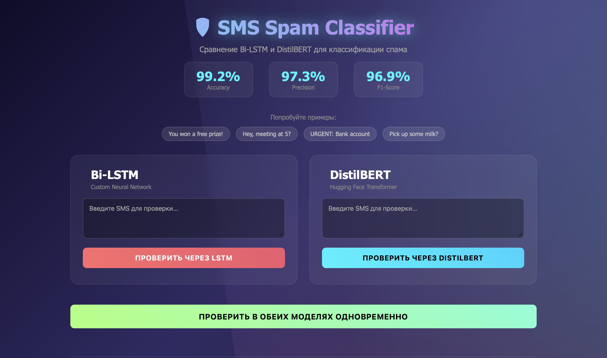
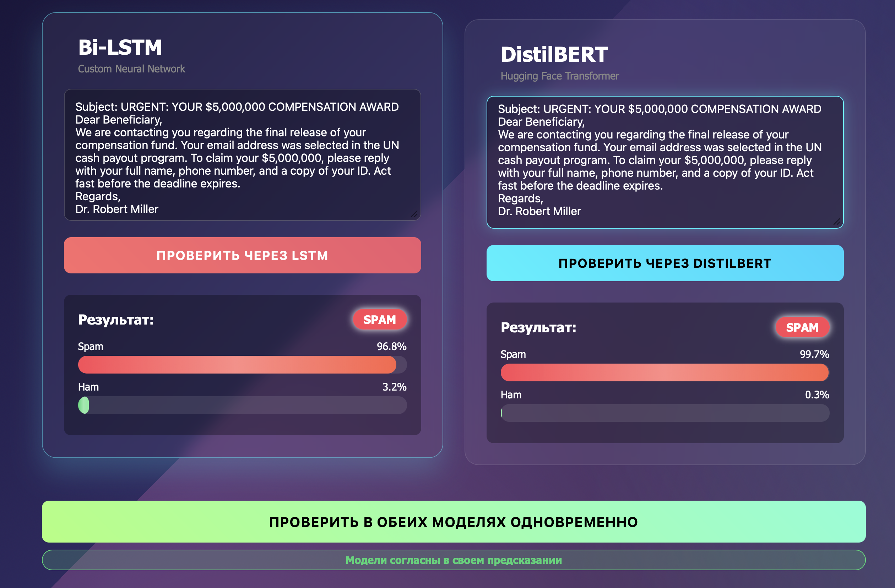
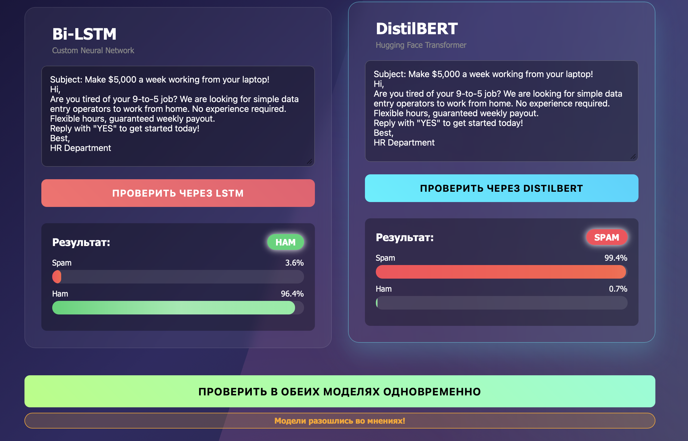

# SMS Spam Classifier: Bi-LSTM vs DistilBERT


**Production-ready NLP API** для классификации SMS-сообщений, сравнивающий две различные архитектуры: кастомную рекуррентную сеть и современный трансформер. Проект реализован с соблюдением лучших практик MLOps: автоматизированное тестирование (CI/CD), версионирование весов через Hugging Face Hub и Docker-контейнеризация.

🔗 **[Live Demo (Render)](https://sms-spam-classifier-bi-lstm-vs-distilbert.onrender.com)** *(может потребоваться ~30 сек для пробуждения сервиса)*

---

## ️ Демонстрация интерфейса

### Основной интерфейс


*Интерфейс позволяет сравнивать предсказания двух моделей в реальном времени. На скриншоте показан случай, когда модели расходятся во мнениях: Bi-LSTM классифицирует сообщение как спам (91%), а DistilBERT — как легитимное (95.5%).*

### Когда модели согласны


*Обе модели пришли к одинаковому выводу — это повышает уверенность в правильности классификации.*

### Расхождение моделей


*Интересный кейс: разные архитектуры по-разному интерпретируют один и тот же текст. Это демонстрирует важность использования ансамблей моделей в production-системах.*

## Описание проекта

API для классификации SMS-сообщений на спам/не спам с использованием двух архитектур:
- **Bi-LSTM** (написана с нуля на PyTorch)
- **DistilBERT** (fine-tuning предобученной модели через Hugging Face)

Проект демонстрирует эволюцию подходов в NLP: от классических рекуррентных сетей к современным трансформерам.

## Сравнение моделей

Обе модели обучались на [UCI SMS Spam Collection Dataset](https://archive.ics.uci.edu/ml/datasets/sms+spam+collection) (5572 сообщения).

| Метрика | Bi-LSTM (Custom) | DistilBERT (Hugging Face) |
|---------|------------------|---------------------------|
| **Accuracy** | 0.9587 | **0.9919** |
| **Precision** | 0.8503 | **0.9730** |
| **Recall** | 0.8389 | **0.9664** |
| **F1-Score** | 0.8446 | **0.9697** |
| **Параметры** | ~500K | ~67M |

**Вывод:** DistilBERT показывает на 12.5% лучший F1-Score благодаря предобученным языковым представлениям.

## Быстрый старт

### Локальный запуск

```bash
# 1. Клонируем репозиторий
git clone https://github.com/devfounder1/SMS-Spam-Classifier-Bi-LSTM-vs-DistilBERT.git
cd SMS-Spam-Classifier-Bi-LSTM-vs-DistilBERT

# 2. Создаем виртуальное окружение и устанавливаем зависимости
python -m venv venv
source venv/bin/activate  # Для Windows: venv\Scripts\activate
pip install -r requirements.txt

# 3. Запускаем API сервер
uvicorn api:app --reload
```
*Примечание: Для работы API предварительно необходимо обучить и сохранить модели, запустив скрипты `LSTM_classifier.py` и `distilBERT_classifier.py`, чтобы в папке `models/` появились веса.*

### Docker Запуск

```bash
# 1. Собираем образ
docker build -t spam-classifier .

# 2. Запускаем контейнер
docker run -p 8000:8000 spam-classifier
```
API будет доступен по адресу: http://localhost:8000

##  API Endpoints

### Health Check
```bash
curl http://localhost:8000/
```

### Предсказание через Bi-LSTM
```bash
curl -X POST "http://localhost:8000/predict/lstm" \
  -H "Content-Type: application/json" \
  -d '{"text": "Win a free iPhone now!"}'
```

### Предсказание через DistilBERT
```bash
curl -X POST "http://localhost:8000/predict/distilbert" \
  -H "Content-Type: application/json" \
  -d '{"text": "Win a free iPhone now!"}'
```

### Пример ответа API:
```json
{
  "text": "Win a free iPhone now!",
  "model_used": "DistilBERT (Hugging Face)",
  "is_spam": true,
  "confidence_spam": 0.9875,
  "confidence_ham": 0.0125
}
```

### Swagger UI
Интерактивная документация доступна по адресу: http://localhost:8000/docs

### MLOps и Инженерные решения
1. Версионирование моделей: Веса (~270 МБ) не хранятся в Git. Они загружаются динамически с Hugging Face Hub через скрипт download_models.py или прямо в процессе сборки Docker-образа.
2. CI/CD Pipeline: Настроен GitHub Actions (.github/workflows/ci.yml). При каждом push в main автоматически запускаются:
- **Линтинг кода (flake8)**
- **Unit-тесты API (pytest), включая проверку валидации пустых запросов и корректности схем Pydantic.**
3. Защита от Data Leakage: Предобработка текста (очистка, токенизация) применяется строго к входящим данным инференса, идентично пайплайну обучения.
4. Graceful Degradation: Если модели не загружены (например, в среде CI), тесты корректно пропускаются (@pytest.mark.skipif), не ломая пайплайн.

## Модели
Модели не включены в репозиторий из-за размера. Для локального запуска:
1. Запустите LSTM_classifier.py для обучения и сохранения LSTM модели
2. Запустите destilBERT_classifier.py для fine-tuning DistilBERT
3. Модели сохранятся в папку models/

## ️Технологии

1. **Python 3.10**
2. **PyTorch 2.0+** — фреймворк для глубокого обучения
3. **Hugging Face Transformers** — библиотека для работы с предобученными моделями
4. **FastAPI** — современный веб-фреймворк для API
5. **Docker** — контейнеризация приложения
6. **Scikit-learn** — метрики и разделение данных

## Структура проекта
```text
.
├── .github/workflows/ci.yml      # Конфигурация GitHub Actions (Lint + Pytest)
├── api.py                        # FastAPI сервер с эндпоинтами и логикой сравнения
├── download_models.py            # Скрипт для загрузки весов с Hugging Face Hub
├── test_api.py                   # Unit-тесты для проверки API
├── LSTM_classifier.py            # Скрипт обучения Bi-LSTM с нуля (для воспроизведения)
├── distilBERT_classifier.py      # Скрипт fine-tuning DistilBERT (для воспроизведения)
├── requirements.txt              # Зависимости проекта
├── Dockerfile                    # Инструкции для сборки production-контейнера
├── screenshots/                  # Скриншоты веб-интерфейса
└── README.md                     # Эта документация
```
*(Папка models/ исключена через .gitignore)*

### Roadmap
- Реализация и сравнение двух архитектур (Bi-LSTM vs DistilBERT)
- Создание интерактивного веб-интерфейса и Swagger-документации
- Настройка CI/CD пайплайна (GitHub Actions) с автоматическим тестированием
- Интеграция Hugging Face Hub для управления весами моделей
- Успешный Cloud Deployment (Render)
- Экспорт моделей в формат ONNX для ускорения CPU-инференса и снижения footprint
- Добавление мониторинга метрик API в реальном времени (Prometheus + Grafana)
- Логирование всех предсказаний в базу данных для последующего анализа Data Drift

## Лицензия
Этот проект распространяется под лицензией MIT. Подробности в файле [LICENSE](LICENSE).